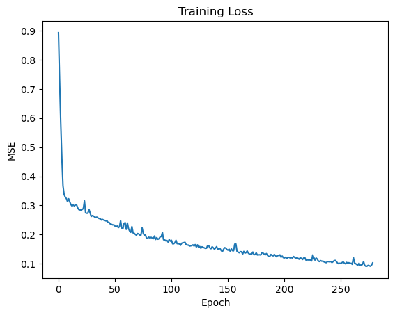
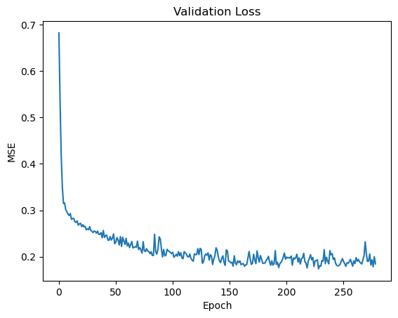

# 🏠 California Housing Price Prediction (PyTorch)

A complete end-to-end Machine Learning project that predicts housing prices using a Neural Network built with PyTorch.

The dataset is based on the California Housing dataset from:

📖 *Hands-On Machine Learning with Scikit-Learn, Keras, and TensorFlow*  
by Aurélien Géron

---

## 📌 Project Overview

This project implements a professional ML pipeline including:

- Data Cleaning  
- One-Hot Encoding  
- Feature Scaling (No Data Leakage)  
- Target Scaling  
- Train/Test Split  
- Mini-Batch Training (DataLoader)  
- Neural Network Regression  
- Early Stopping  
- RMSE Evaluation (Real Dollar Value)  
- Training & Validation Loss Visualization  

---

## 🧠 Model Architecture

Neural Network Structure:

Input → 64 → 32 → 1  

- Activation: ReLU  
- Optimizer: Adam  
- Learning Rate: 0.001  
- Regularization: Weight Decay (L2)  
- Loss Function: MSELoss  

---

## ⚙️ Machine Learning Pipeline

1. Load Dataset  
2. Handle Missing Values  
3. One-Hot Encode `ocean_proximity`  
4. Train/Test Split  
5. Fit Scalers ONLY on Training Data  
6. Transform Train and Test Separately  
7. Convert to PyTorch Tensors  
8. Train Using Mini-Batches  
9. Apply Early Stopping  
10. Evaluate Using RMSE  
11. Visualize Loss Curves  

---

## 📊 Results

The model achieves:

- Stable Convergence  
- Controlled Overfitting  
- Competitive RMSE Compared to Linear Regression Baseline  

Typical RMSE Range:

45,000 – 60,000 Dollars  
(depending on random seed and split)

---

## 📈 Visualizations

### 🔹 Training Loss Curve

Shows how the model optimizes during training.



---

### 🔹 Validation Loss Curve

Used to detect overfitting and control generalization.



---

## 🚀 Installation

```bash
pip install torch pandas numpy scikit-learn matplotlib

